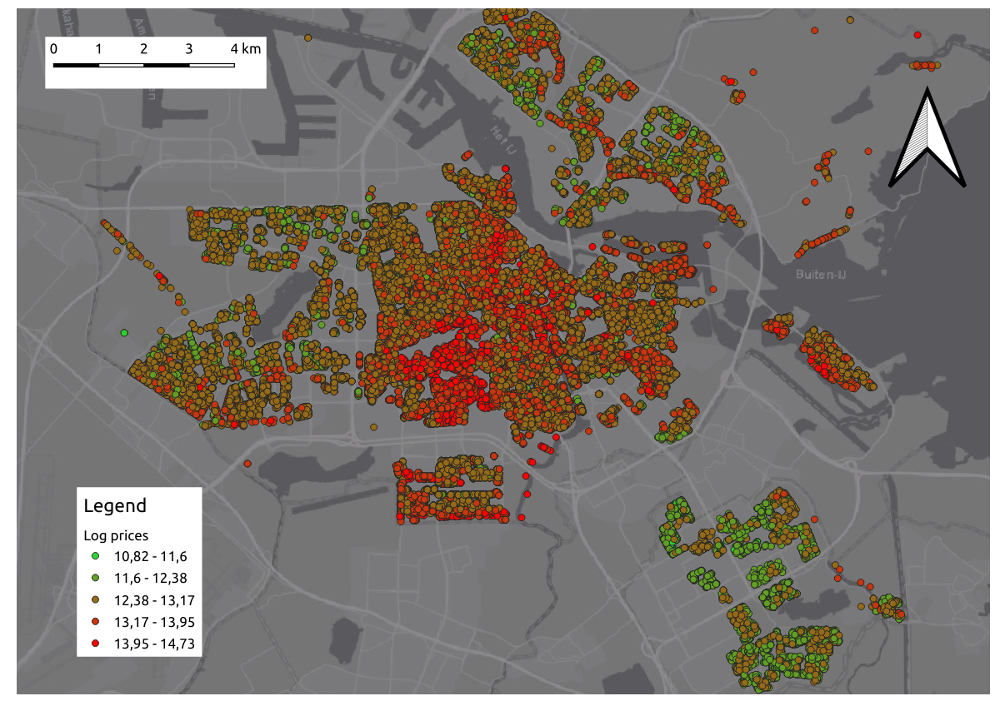

```{r packages descriptdasdsadive analysis, include=FALSE}
# Package names
packages <- c("haven", "ggplot2", "psych", "dplyr", "knitr")

# Install packages not yet installed
installed_packages <- packages %in% rownames(installed.packages())
if (any(installed_packages == FALSE)) {
  install.packages(packages[!installed_packages])
}

# Packages loading
invisible(lapply(packages, library, character.only = TRUE))
```

```{r read data descriptive analysis, include = FALSE}

data<-read_dta(
  "../data/AIRBNB_Houseprices.dta",
  encoding = NULL,
  col_select = NULL,
  skip = 0,
  n_max = Inf,
  .name_repair = "unique"
)

data_c <- read.csv("../data/data_c.csv")
```

In order to get a better understanding of the data, we present some descriptive analysis as well as correlations. Note for causality, correlation is a necessary condition. 
In the following, we use the data set without outliers.

First, we give an overview of some summary statistics. In particular, we see a very high variability of the density data.

```{r, echo = FALSE}
names <- c("quality", "density", "garden" , "lsize"  ,              "volume"  , "rooms", "parking", "buyerpaysorfree" ,    "lprice")
data2_c <- data_c[,which(colnames(data_c) %in% names)]
kable(describe(data2_c, omit=TRUE), caption = "Summary statistics", digits=3)
```

Now, we look at the logarithmized prices in time. We use logarithmized prices in order to account for the skewness of the price data. We see a wide spread in each year with a steady increase after 2015.

```{r, echo = FALSE}
ggplot(data = data_c, aes(x= as.factor(year), y = lprice)) +
  geom_boxplot()+
  theme_bw()+
  labs(y= "Log Price", x = "Year" )+
  theme(text=element_text(family="serif"))
```

Next, we take a look at the spatial distribution of the logarithmized prices. We see some clusters of low prices in the outer areas and higher prices in the center. This hints that we need to control for location, e.g. by postal code.


